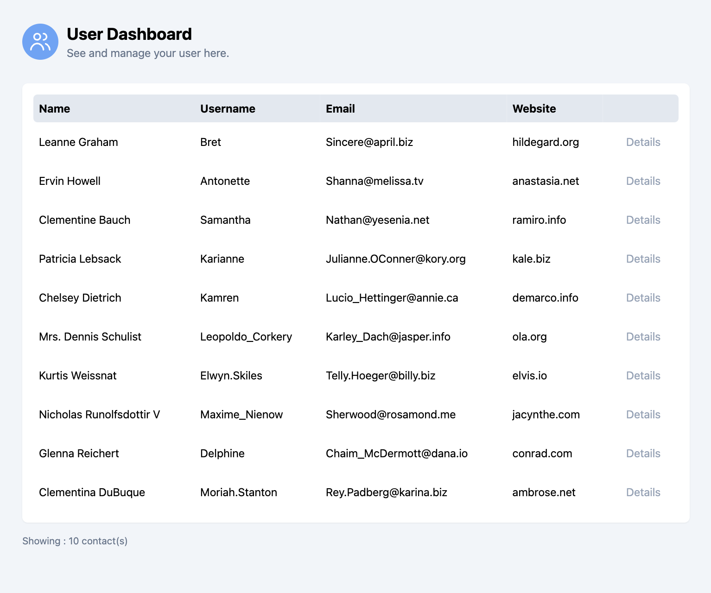
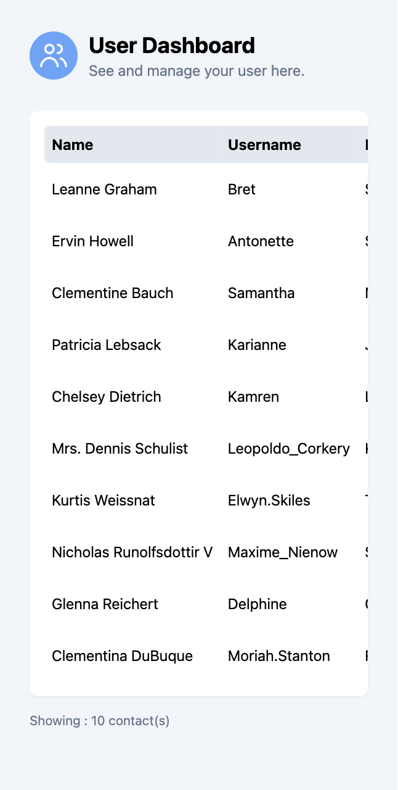

# AngularDemo

This project is created to demonstrate angular basic features (Routing, Fetching API, Observables (rxjs), Control flow, Testing)

## Preview

<div style="display: flex; gap: 0.5rem;">
  
  
</div>

## Setup project on local machine

This project is created with Angular v18 and `pnpm`, but if you're not using `pnpm`, `npm` should be sufficient.

### Run development server

```bash
pnpm start
or
ng serve
```

Then, open http://localhost:4200/ in your browser. The application will automatically reload if you change any of the source files.

### Run unit tests

```bash
pnpm test
or
ng test
```

### Build

```bash
pnpm build
or
ng build
```

The build artifacts will be stored in the `dist/` directory.
